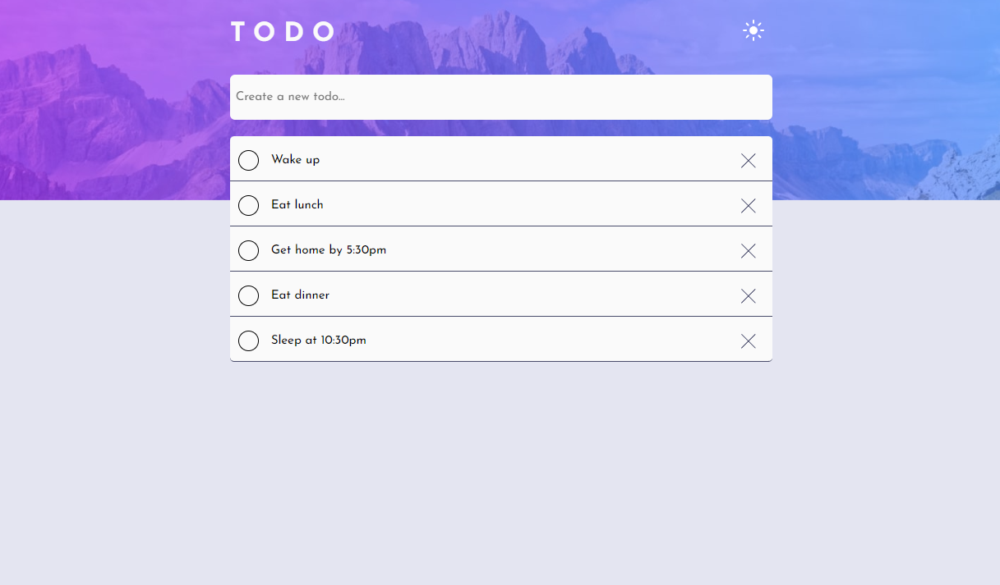

# Frontend Mentor - Todo app solution

This is a solution to the [Todo app challenge on Frontend Mentor](https://www.frontendmentor.io/challenges/todo-app-Su1_KokOW). Frontend Mentor challenges help you improve your coding skills by building realistic projects. 

## Table of contents

- [Overview](#overview)
  - [The challenge](#the-challenge)
  - [Screenshot](#screenshot)
  - [Links](#links)
- [My process](#my-process)
  - [Built with](#built-with)
  - [What I learned](#what-i-learned)
  - [Continued development](#continued-development)
  - [Useful resources](#useful-resources)
- [Author](#author)
- [Acknowledgments](#acknowledgments)

## Overview
the main goal of this project is to create a visually-appealing todo list web app.

### The challenge

Users should be able to:

- View the optimal layout for the app depending on their device's screen size
- See hover states for all interactive elements on the page
- Add new todos to the list
- Mark todos as complete
- Delete todos from the list
- Filter by all/active/complete todos
- Toggle light and dark mode

### Screenshot

### Links

- Solution URL: [Add solution URL here](https://your-solution-url.com)
- Live Site URL: [Add live site URL here](https://www.frontendmentor.io/challenges/todo-app-Su1_KokOW/hub/todo-app-SkE3HseI5)

## My process

I have taken a lot of long breaks on this project so I may not remember exactly what I did so sorry in advance.

- I started with looking at the mobile version of the site and began to map out how I wanted position all the elements
- I recreated the style of the mobile appearence (to the best of my ability)
- I added media queries to adjust the styles of the website to better fit desktops
- I added the javascript functionality
- decided that I would only add the ability to add and delete items, rather than all of the intended functionalities
- changed the website it didnt imply any non-existent functionality (i.e anything other than basic functionality) 

### Built with

- CSS custom properties
- Mobile-first workflow
- javascript

### What I learned

- At somepoint I learned the difference between an array and an array-like object, and what methods can and can't be used with each
- I learned about mapping out what you want your code to do before actually writing anything
- I got better at using things like stack overflow, devtools, and other forums to solve problems

### Continued development

- For starters, I want to eventually add the rest of the intended functionality, as starting this project as my first intermediate project was too ambitous for me at my current skill level.
- I want to try and turn this project into a CRUD app using a tech stack like mern
- I want to make the web app more polished, like adding animations to adding and deleting items
- get more consistent with adding comments to my code 

### Useful resources

- [freshman.tech](https://freshman.tech/todo-list/) - Besides the fact that I essentailly copied their code one for one, reading their process, and fixing errors and bugs helped me understand how javascript is used in websites.

## Author

- Frontend Mentor - [@Nano950](https://www.frontendmentor.io/profile/Nano950)